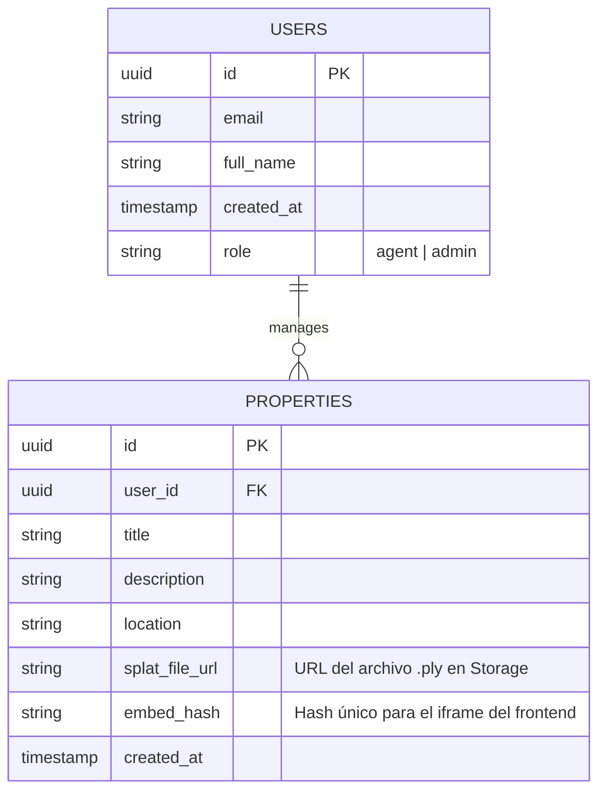
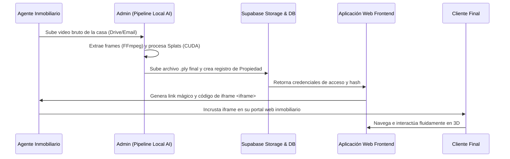

<div align="center">

# 🏗️ Documento de Arquitectura: Plataforma SaaS de Recorridos 3D Inmobiliarios

**Plano técnico completo fundamentado en los pilares de la habilidad El Arquitecto (01).**

</div>

### Tecnologías usadas
```javascript
const Scan3D_Project = {
    code: ["React 19", "WebGL", "Python"],
    technologies: {
        devTool: ["VSCode", "Vite"],
        apis: ["Supabase", "GaussianSplats3D"],
        assets: ["CUDA", "Three.js"]
    }
};
```
---
## 1. Analizar y Justificar el Stack Tecnológico

- **Frontend / UI**: Vite + React 19. 
  - **Justificación**: React posee el ecosistema más maduro para WebGL (React Three Fiber, Drei) y Vite garantiza compilaciones y *Hot Module Replacement* (HMR) extremadamente rápidos frente a alternativas lentas como CRA/Webpack.
- **Estilos**: Vanilla CSS con variables CSS (Custom Properties). 
  - **Justificación**: Máximo control sobre el renderizado, rendimiento sin dependencias de compilación pesadas, e ideal para diseños *glassmorphism* y animaciones sutiles sin overhead extra.
- **Motor 3D**: `GaussianSplats3D` (WebGL / Three.js). 
  - **Justificación**: Es la tecnología de vanguardia (*State of the Art*) para renderizar, cargar e interactuar con nubes de puntos densas (`.ply` / splats) de manera fluida y nativa en el navegador del usuario.
- **Backend y Autenticación**: Supabase (PostgreSQL, Auth, Storage). 
  - **Justificación**: Proporciona una base de datos relacional robusta, almacenamiento optimizado en la nube para hospedar los pesados archivos 3D y autenticación segura *out-of-the-box* con SDK nativo para React, acelerando el *time-to-market*.
- **Procesamiento de IA (Gaussian Splatting)**: Pipeline Local (Python, CUDA, Inria Repo). 
  - **Justificación**: Estrategia de contención de costos (*Lean Startup*). Se evitan los altísimos cobros por segundo de las GPUs en la nube inicializando el renderizado de los fotogramas en hardware local de gama alta (ej. RTX 4090).

---

## 2. Planificar la Estructura de Directorios

El ecosistema de carpetas ha sido estructurado buscando la máxima modularidad y preparación para escalado internacional y regulatorio.

```text
3d-scan/
├── public/                 # Assets estáticos y splats de demostración (.ply)
│   ├── .well-known/        # Configuraciones públicas de verificación y seguridad (security.txt)
│   └── splats/             # Archivos .ply y recursos 3D locales (mockups)
├── src/
│   ├── assets/             # Imágenes, iconos, fuentes y estilos globales
│   │   ├── css/            # Estilos Vanilla CSS modulares
│   │   └── locales/        # Archivos JSON para futuras traducciones (i18n)
│   ├── components/         # Componentes React reutilizables (Botones, Modales, Visor3D)
│   ├── pages/              # Vistas principales (Landing, Dashboard, Auth)
│   ├── hooks/              # Hooks personalizados (ej. useAuth, use3DViewer)
│   ├── utils/              # Funciones auxiliares, validaciones, utilidades
│   ├── App.jsx             # Componente raíz y enrutador principal
│   └── main.jsx            # Punto de entrada de la aplicación Vite
├── .env.example            # Plantilla de variables de entorno (Obligatoria, Sin secretos)
├── .gitignore              # Exclusión estricta de archivos sensibles y /node_modules
├── eslint.config.js        # Reglas de linteo y calidad de código
├── package.json            # Dependencias del proyecto
├── vite.config.js          # Configuración del empaquetador
└── README.md               # Este documento de arquitectura (fuente de la verdad)
```

---

## 3. Modelo de Datos e Integridad (ERD)

La base de datos relacional (alojada en Supabase/PostgreSQL) gestiona la vinculación entre los clientes, las propiedades inmobiliarias escaneadas y los pesados archivos 3D alojados en el Storage.



---

## 4. Flujos de Usuario e Integración de Sistemas

Flujo secuencial que detalla el viaje de los datos desde la grabación del entorno hasta que el usuario final interactúa con la casa 3D en su navegador.



---

## 5. Cumplimiento Normativo y Seguridad por Diseño (Compliance)

- **Leyes de Privacidad (DSGVO / GDPR y TDDDG)**: 
  - La aplicación implementará un sistema de *Cookie Consent* de suscripción rigurosa (Opt-In). Los rastreadores de analítica no se inyectarán en el DOM hasta obtener el consentimiento explícito del visitante.
  - La persistencia de datos (Supabase) se provisionará en un clúster geolocalizado en la Unión Europea (ej. Frankfurt) garantizando la soberanía de los datos. Encriptación completa de datos en reposo y en tránsito (HTTPS/TLS AES-256).
- **Estrategia de Rate Limiting (Limitación de Tasa)**: 
  - Se delegará la protección contra ataques de fuerza bruta (Brute-force) y denegación de servicio (DDoS) a las reglas proxy perimetrales de **Cloudflare**. 
  - El backend de Supabase Auth posee Rate Limiting activo de forma nativa para mitigar envíos masivos de contraseñas.
- **Aislamiento de Datos Sensibles**:
  - Queda **estrictamente prohibido el hardcoding** de cualquier clave API (`VITE_SUPABASE_URL`, `VITE_SUPABASE_ANON_KEY`) dentro de los componentes `.jsx`.
  - El archivo `.env` ha sido añadido al `.gitignore`. Cualquier clonación o despliegue del proyecto debe hidratarse usando únicamente la referencia de estructura vacía disponible en `.env.example`.

---

## 6. Diseño Responsive y Adaptable (Mobile-First)

- **Estrategia de Estilos**: Se estructura todo el CSS apoyado en `display: flex` y `display: grid`. Las *Media Queries* se configuran de forma ascendente (Desktop-First prohibido), comenzando con el comportamiento móvil base (`min-width: 320px`) hacia resoluciones *Ultra-wide*.
- **Tipografía y Proporciones Fluidas**: Se utilizarán medidas relativas (`rem`, `vh`, `vw`, y la función CSS `clamp()`) asegurando que el *canvas* del visor 3D se redimensione de forma orgánica y fluida en cambios de orientación.
- **Rendimiento Dinámico del Hardware**: El código del visor web 3D evaluará la clase de dispositivo conectado (mediante detección *User-Agent* y `window.devicePixelRatio`). Si detecta un smartphone, el motor limitará el conteo de Splats renderizados y el *Anti-Aliasing* para garantizar 60 FPS estables sin sobrecalentar el teléfono móvil del usuario final.

---

## 7. Gestión de Riesgos y Mitigaciones

1. **Riesgo**: Archivos de nubes de puntos (`.ply`) demasiado pesados (varios cientos de MB), causando tiempos de carga inaceptables, bloqueando el hilo de renderizado del navegador y frustrando al cliente.
   - **Estrategia de Mitigación**: Aplicar una etapa de compresión algorítmica de los splats en el pipeline antes de subirlos a producción. Implementar un *Loader* altamente estético e interactivo (barra de progreso circular con porcentaje) en el frontend mientras el archivo es transmitido, mejorando la percepción de espera (UX).
   
2. **Riesgo**: Costos financieros prohibitivos en Ancho de Banda (Egress) desde Supabase Storage por descargas masivas y recurrentes de archivos 3D pesados.
   - **Estrategia de Mitigación**: Implementar una CDN de almacenamiento en caché agresiva (Cloudflare) delante del *bucket* de Supabase. Añadir cabeceras HTTP restrictivas `Cache-Control: public, max-age=31536000` para los archivos estáticos `.ply`. Las peticiones subsecuentes al mismo modelo no golpearán la cuota de Supabase.

3. **Riesgo**: El cliente (Agente inmobiliario) suministra videos mal grabados (rápidos, desenfocados) causando fallos masivos y tiempos muertos en el script local de Inteligencia Artificial (COLMAP y Gaussian Splatting).
   - **Estrategia de Mitigación**: Desarrollar e integrar una guía interactiva en el Dashboard con "Instrucciones de Grabación" (moverse lentamente, iluminación uniforme, trayectorias en bucle). Adicionalmente, establecer límites duros automáticos donde la duración del video de entrada sea estrictamente proporcional a los m² contratados por el agente (Ej. Límite de 4 minutos de video por cada 100m²).

---
> [!NOTE]
> **Explorar siguientes proyectos:**
> *   [`ArteQ`](./ArteQ.md)
> *   [`MyBC`](./MyBC.md)
> *   [`UmzugEstimator`](./UmzugEstimator.md)
> *   [`PropuestaGlow`](./PropuestaGlow.md)
> *   [`ArteQ-IT`](./ArteQ-IT.md)
---
