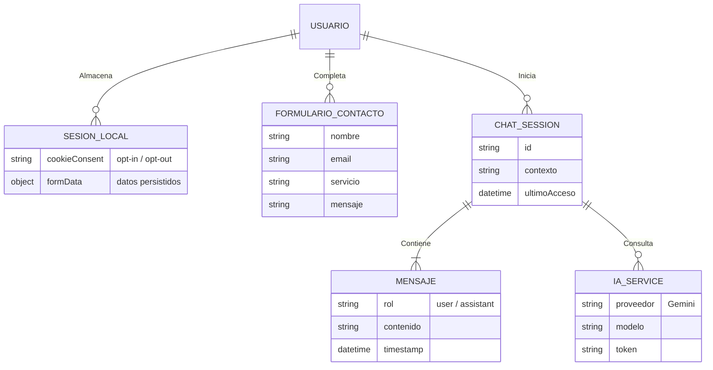
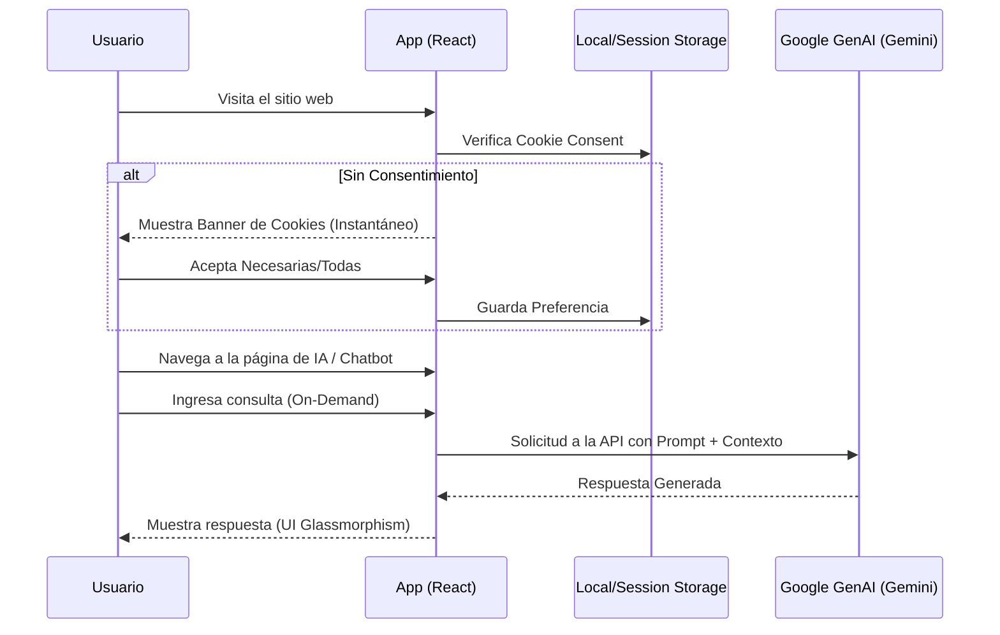

# Project Architecture & Design - ArteQ-IT 🏗️

Este documento define la arquitectura técnica, el stack tecnológico, los flujos de usuario y las directrices de cumplimiento normativo y seguridad para el proyecto **ArteQ-IT**. Sirve como fuente de verdad y plano técnico para el desarrollo.

---

## 1. Stack Tecnológico (Análisis y Justificación)

La arquitectura técnica ha sido seleccionada para maximizar el rendimiento, la escalabilidad, la experiencia de usuario (UX) y la integración con Inteligencia Artificial.

### Frontend
- **Framework**: **React 19** + **TypeScript**. Proporciona tipado estricto, mitigando errores en tiempo de desarrollo. React 19 ofrece optimizaciones de renderizado avanzadas.
- **Build Tool**: **Vite**. Garantiza tiempos de compilación y Hot Module Replacement (HMR) extremadamente rápidos.
- **Enrutamiento**: **React Router (v7)**. Permite navegación dinámica SPA mejorando el SEO y la segmentación de código.
- **Estilos**: **Tailwind CSS**. Permite diseño *Mobile-First* rápido y utilitario, manteniendo un *bundle* pequeño. Se combina con estéticas *Glassmorphism*.

### Componentes y Utilidades
- **Notificaciones UI**: **SweetAlert2**. Proporciona alertas modulares y *premium*.
- **Iconografía**: **Lucide React**. Iconos ligeros y consistentes.
- **Procesamiento de Documentos (Local)**: **pdfjs-dist**, **mammoth**, **html2pdf.js**, **jspdf**. Permiten la lectura y generación de documentos en el lado del cliente sin enviar datos a servidores externos, garantizando la privacidad.
- **Criptografía**: **crypto-js**. Para encriptación y ofuscación de datos sensibles en cliente (ej. correos anti-scraping).

### IA y Servicios Externos
- **Inteligencia Artificial**: **Google GenAI** (Gemini). Integrado vía API para el ecosistema de agentes (ChatBot, Análisis de CVs). Las llamadas se realizan *On-Demand* por acción explícita del usuario.

### Despliegue
- **Infraestructura**: **Cloudflare Pages**. Despliegue rápido, CDN global, y seguridad de red nativa.

---

## 2. Estructura de Directorios

La estructura del proyecto está diseñada para ser modular y escalable.

```text
/
├── .env.local                  # Variables de entorno (Oculto en Git)
├── public/                     # Assets públicos y estáticos
├── src/                        # Código fuente de la aplicación
│   ├── components/             # Componentes de UI reutilizables
│   ├── pages/                  # Vistas principales/Rutas
│   ├── services/               # Lógica de negocio e integración de APIs (IA)
│   ├── data/                   # Datos locales y constantes
│   ├── index.css               # Estilos globales (Tailwind)
│   ├── App.tsx                 # Enrutador principal y layout
│   └── index.tsx               # Punto de entrada de React
├── dist/                       # Build de producción (Generado)
├── package.json                # Dependencias y scripts
├── tailwind.config.js          # Configuración de Tailwind y diseño
├── tsconfig.json               # Configuración de TypeScript
└── vite.config.ts              # Configuración de Vite
```

---

## 3. Modelo de Datos e Integridad (ERD Conceptual)

Aunque la aplicación se basa fuertemente en el cliente, existe un modelo conceptual de datos para el estado local, persistencia en sesión y la interacción con la IA.



---

## 4. Flujos de Usuario e Integración de Sistemas

Diagrama del flujo de interacción principal, incluyendo el sistema de consentimiento y la comunicación con servicios externos.



---

## 5. Cumplimiento Normativo y Seguridad por Diseño

La aplicación está diseñada bajo las premisas de **Privacy by Design** y cumple con el **DSGVO (RGPD)** y **TDDDG** de Alemania.

### Cumplimiento Legal (DSGVO / TDDDG)
- **Cookies y Rastreo**: Sistema de Consentimiento de Cookies granular (*opt-in* riguroso) implementado. Sin carga de scripts externos de análisis o marketing antes de la aceptación explícita.
- **Autohospedaje (Self-Hosting)**: Eliminación total de llamadas automáticas a dominios externos. Fuentes, iconos y librerías se sirven localmente.
- **Procesamiento de Datos Local**: La extracción y análisis de documentos (PDFs, Word) se procesa en el navegador del cliente mediante `pdfjs-dist` y `mammoth`. Sólo los extractos de texto viajan a la IA previa acción explícita.
- **Política de Privacidad y AGB**: Páginas de términos y protección de datos (Datenschutz, Impressum) accesibles globalmente y pre-consentimiento.

### Seguridad (Security by Design)
- **Aislamiento de Secretos**: Prohibición de *hardcoding*. Las claves de API (ej. Gemini) deben configurarse en `.env.local` excluido del control de versiones (`.gitignore`).
- **Protección Anti-Scraping**: Implementación de ofuscación de correos electrónicos y bloqueo de menús contextuales en partes sensibles de la aplicación.
- **Sanitización**: Todo input del usuario (ej. formulario de contacto, chatbot) es sanitizado antes de su procesamiento o renderizado para prevenir ataques XSS.
- **Rate Limiting**: Mitigación inicial mediante Cloudflare (nivel de red) en el entorno de producción.

---

## 6. Diseño Responsive y Adaptable (Mobile-First)

La interfaz se estructura sobre una filosofía **Mobile-First**, asegurando una experiencia óptima desde smartphones hasta pantallas *ultra-wide*.

- **Estrategia de Estilos**: Uso de Flexbox y CSS Grid a través de **Tailwind CSS**.
- **Breakpoints**: Se utilizan los breakpoints por defecto de Tailwind (`sm`, `md`, `lg`, `xl`, `2xl`) para escalar la UI progresivamente.
- **Visuales**: Diseño basado en *Glassmorphism*, con capas translúcidas, desenfoque de fondo y tipografía moderna y fluida. Los fondos generativos (Canvas) se adaptan dinámicamente al *viewport*.
- **Interactividad**: Uso de *micro-interacciones* y animaciones sutiles para mejorar el *feedback* del usuario.

---

## 7. Gestión de Riesgos y Mitigaciones

| Riesgo Técnico | Impacto | Estrategia de Mitigación |
| :--- | :--- | :--- |
| **Exposición de Claves API (Gemini) en Cliente** | Alto | Como aplicación SPA sin backend proxy propio por el momento, la clave reside en el build de Vite. **Mitigación**: Se usará ofuscación o en futuras iteraciones arquitectónicas se implementarán *Cloudflare Workers* (Edge Functions) para ocultar las llamadas a la API detrás de un endpoint intermedio seguro. |
| **Agotamiento de Cuota de API (IA)** | Medio | **Mitigación**: Implementar rate-limiting local, caché de respuestas frecuentes y botones de acción *on-demand* estricta (no precargas). |
| **Pérdida de Datos en Formularios Largos** | Medio | **Mitigación**: Se implementa un motor de persistencia (`sessionStorage`) que guarda el progreso del usuario en formularios mientras navega por páginas legales, restaurándolos al volver. |
| **Sobrecarga del Main Thread (Fondos Canvas)** | Medio | Las animaciones complejas en Canvas pueden ralentizar dispositivos antiguos. **Mitigación**: Uso de `requestAnimationFrame` optimizado, limpieza de recursos al desmontar componentes (`useEffect cleanup`) y posible degradación visual en dispositivos de bajo rendimiento. |
