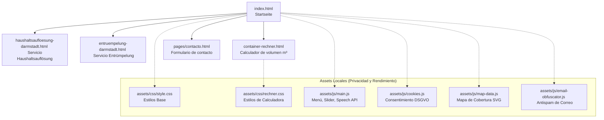
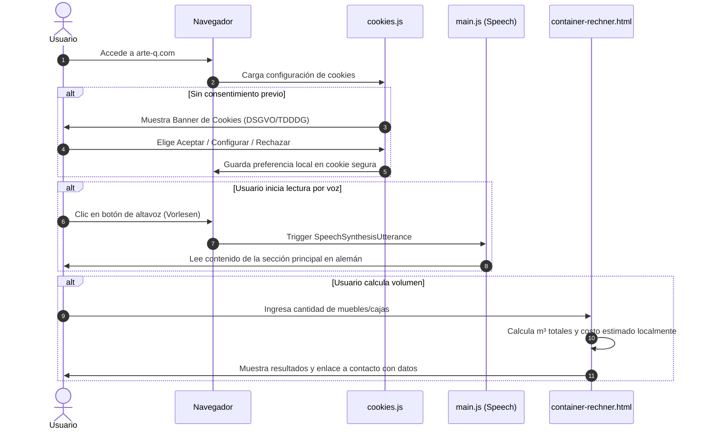

# Arquitectura de Software e Interacción Técnica - ARTEQ

Este documento detalla la estructura técnica, flujo de navegación e interacción de componentes para el sitio web de **ARTEQ** (Dienstleistungen für Räumung, Umzüge, Transport und Reinigung). Está diseñado para servir como referencia a desarrolladores y agentes de IA.

---

## 1. Estructura de la Aplicación y Componentes

El proyecto es un sitio web estático optimizado para SEO, accesibilidad y velocidad, cumpliendo estrictamente con las regulaciones de privacidad **DSGVO / TDDDG**.



---

## 2. Flujo de Navegación del Usuario y Eventos

El siguiente diagrama detalla cómo interactúa el usuario final con las herramientas dinámicas de la web (calculadora de volumen, mapa interactivo, lector de voz y banner de cookies):



---

## 3. Detalle de Componentes Clave

### A. Lector por Voz (Speech Synthesis API)
Integrado de manera nativa en [main.js](file:///c:/Users/Student/Documents/DEV/python-tools/HTML/ArteQ/assets/js/main.js). Permite a los usuarios escuchar el texto de la página. Cumple con normativas de accesibilidad web (A11y).
*   **Trigger:** Botón `#readAloudBtn` e `#stopReadingBtn`.
*   **Nativo:** Utiliza la API del navegador (`window.speechSynthesis`), evitando librerías pesadas externas y asegurando el máximo rendimiento.

### B. Gestor de Consentimiento DSGVO / TDDDG
Ubicado en [cookies.js](file:///c:/Users/Student/Documents/DEV/python-tools/HTML/ArteQ/assets/js/cookies.js).
*   Garantiza que las cookies de analítica o marketing se mantengan deshabilitadas de forma predeterminada.
*   Ofrece las tres opciones requeridas legalmente: *Alle akzeptieren* (Aceptar todas), *Einstellungen* (Configurar) y *Ablehnen* (Rechazar no esenciales).

### C. Calculadora de m³ (Widget Flotante y Rechner)
*   **Widget Flotante (`index.html`):** Botón de acceso directo en la esquina inferior derecha. Utiliza un icono de calculadora nativo de FontAwesome (`<i class="fas fa-calculator"></i>`) servido localmente para proteger la privacidad IP de los visitantes.
*   **Página del Rechner (`container-rechner.html`):** Realiza cálculos matemáticos rápidos en el lado del cliente (sin llamadas de servidor) para estimar las dimensiones del contenedor requerido según la lista de inventario ingresada.

## 📁 Estructura de Directorios

```
ARTEQ/
│
├── assets/                       # Statische Dateien
│   ├── css/                      # Stylesheets  (ca. 1620 Zeilen)
│   │   ├── style.css             # Haupt-Stylesheet
│   │   ├── responsive.css        # Stile für Mobilgeräte
│   │   └── fontawesome/          # Font Awesome
│   │       └── webfonts/         # Icons / Schriftart web
│   │           └── all.min.css/  # ⬅️
│   ├── js/                       # JavaScript-Dateien (ca. 575 Zeilen)
│   │   ├── main.js               # Haupt-JavaScript
│   │   └── cookies.js            # Cookie-Verwaltung
│   └── images/                   # Bilder und Icons
│       ├── logo.ico              # Website-Logo
│       ├── favicon.ico           # Browser-Tab-Icon
│       └── ArteQ.png             # Bild Über uns
│
├── pages/                        # Weitere HTML-Seiten  (ca. 560 Zeilen)
│   ├── kontakt.html              # Kontaktseite
│   ├── Impressum.html            # Impressum
│   ├── datenschutz.html          # Datenschutzerklärung
│   ├── terms.html                # Allgemeine Geschäftsbedingungen
│   └── cookies.html              # Cookie-Richtlinie
│
├── index.html                    # Startseite (ca. 558 Zeilen)
└── README.md                     # Projektbeschreibung
```
---
> [!NOTE]
> *   next project [`MyBC.md`](./MyBC.md).
> *   next project [`UmzugEstimator.md`](./UmzugEstimator.md).
> *   next project [`PropuestaGlow.md`](./PropuestaGlow.md).
> *   next project [`ArteQ-IT.md`](./ArteQ-IT.md).
> *   next project [`3D_Scan.md`](./3D_Scan.md).
---