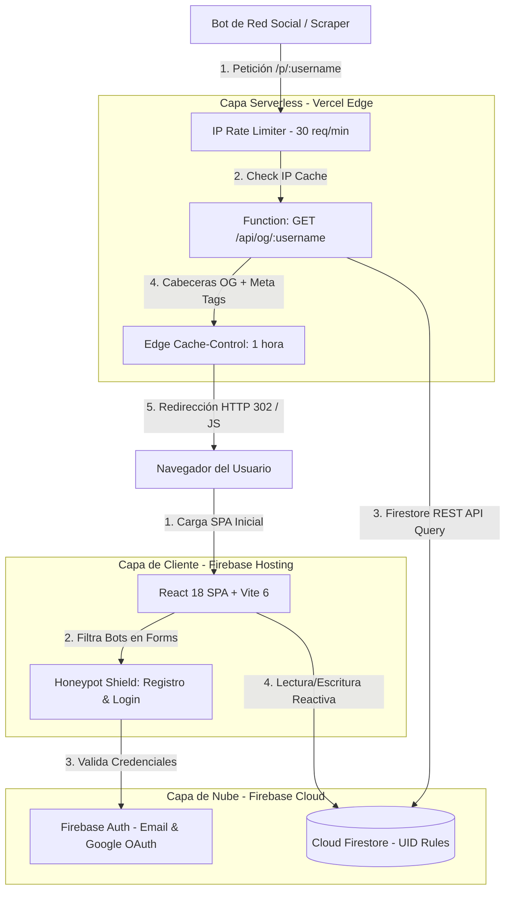

# Arquitectura e Interacción Técnica (myBC)

Este documento detalla la arquitectura de software, flujos de datos y diseño técnico del proyecto **myBC**, cumpliendo con los estándares de diseño escalable y mantenible.

## Tecnologías usadas
```javascript
const MyBC_Project = {
    code: ["React 18", "Vite 6"],
    technologies: {
        devTool: ["VSCode"],
        apis: ["Firebase", "Vercel Edge"],
        assets: ["Honeypot Shield"]
    }
};
```
---
## 1. Arquitectura de Software y Flujo de Datos

myBC implementa una arquitectura híbrida serverless de alto rendimiento que conecta una interfaz de usuario estática React (Vite) con una base de datos reactiva en Cloud Firestore y una API serverless en Vercel Edge.



## 2. Configuración de Variables de Entorno

A continuación, se describen las variables de entorno necesarias para la inicialización y el correcto funcionamiento de los servicios backend (Firebase).

| Variable de Entorno | Descripción Semántica | Obligatorio | Ejemplo / Valor Simulado |
| :--- | :--- | :---: | :--- |
| `VITE_FIREBASE_API_KEY` | Clave de API pública para Firebase. | Sí | `AIzaSyD...` |
| `VITE_FIREBASE_AUTH_DOMAIN` | Dominio de autenticación gestionado. | Sí | `mybc-app.firebaseapp.com` |
| `VITE_FIREBASE_PROJECT_ID` | Identificador único del proyecto. | Sí | `mybc-app` |
| `VITE_FIREBASE_STORAGE_BUCKET` | URL del bucket de almacenamiento. | Sí | `mybc-app.appspot.com` |
| `VITE_FIREBASE_MESSAGING_SENDER_ID`| ID del remitente para notificaciones. | Sí | `123456789012` |
| `VITE_FIREBASE_APP_ID` | Identificador único de la app web. | Sí | `1:123456789012:web:abcde...` |

## 3. Sinergias de Indexación y Localización (i18n & SEO)

> [!IMPORTANT]
> El proyecto ha sido configurado para ofrecer una experiencia global y accesible, integrando los módulos de i18n y SEO/IA de acuerdo a las normativas modernas.

- **i18n (Internacionalización)**: La aplicación detecta automáticamente el idioma del navegador y soporta español (es), inglés (en) y alemán (de). Las preferencias se persisten en `localStorage`.
- **SEO y Visibilidad IA**:
  - `robots.txt`: Optimizado para rastreadores web estándar.
  - `sitemap.xml`: Generado dinámicamente para indexar rutas públicas.
  - `llms.txt` y `llms-full.txt`: Especificaciones técnicas para asistentes de Inteligencia Artificial.
  - `.well-known/security.txt`: Archivo estándar para reporte ético de vulnerabilidades.

### 📁 Estructura de Directorios

```text
myBC/
├── 📂 .firebase/             # Caché local de despliegue de Firebase
├── 📂 api/                   # ⚡ Funciones Backend Serverless (Vercel)
│   └── 📂 og/
│       └── 📄 [username].ts  # Generador de metadatos dinámicos e IP Rate Limiter
├── 📂 public/                # Assets estáticos del servidor e indexación
│   ├── 📂 assets/            # Imágenes de marcador y vectores de marca
│   ├── 📂 fonts/             # Tipografía e iconos empaquetados localmente
│   ├── 📄 robots.txt         # Reglas de indexación para motores tradicionales
│   ├── 📄 sitemap.xml        # Mapa de rutas públicas
│   ├── 📄 llms.txt           # Especificación resumida para IAs (Perplexity, OpenAI)
│   └── 📄 llms-full.txt      # Especificación completa del codebase para IAs
├── 📂 src/                   # 💻 Código Fuente Principal
│   ├── 📂 components/        # Componentes UI de diseño (SocialAuth, CookieBanner)
│   ├── 📂 locales/           # Archivos JSON de i18n (es.json, en.json, de.json)
│   ├── 📂 screens/           # Pantallas de la SPA (Login, Register, Settings)
│   │   └── 📂 templates/     # Diseños visuales de tarjetas (Modern, Minimal)
│   ├── 📂 services/          # Conexión e inicialización de Firebase
│   ├── 📂 utils/             # Helpers (vCard generator, base64 image compressor)
│   ├── 📄 App.tsx            # Enrutador dinámico (Dynamic Route-Splitting)
│   └── 📄 types.ts           # Modelos de datos compartidos en TypeScript
├── 📄 firestore.rules        # Reglas granulares de seguridad de la base de datos
├── 📄 vite.config.ts         # Reglas avanzadas de compilación y Vendor Chunks
└── 📄 vercel.json            # Configuración de ruteo serverless
```
---
> [!NOTE]
> **Explorar siguientes proyectos:**
> *   [`ArteQ`](./ArteQ.md)
> *   [`UmzugEstimator`](./UmzugEstimator.md)
> *   [`PropuestaGlow`](./PropuestaGlow.md)
> *   [`ArteQ-IT`](./ArteQ-IT.md)
> *   [`3D_Scan`](./3D_Scan.md)
---