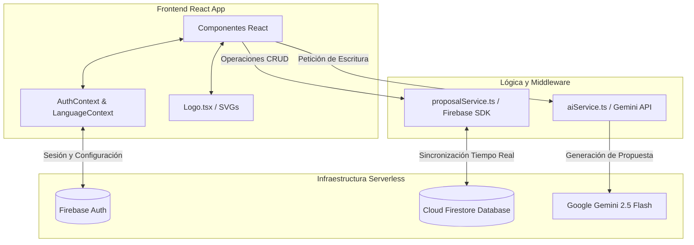

# Arquitectura de Software e Interacción Técnica 🏗️

Este documento detalla la estructura técnica de la plataforma **Propuesta Glow**, describiendo la interacción de sus componentes core, flujo de datos y modelo de seguridad.

---

## 1. Diagrama de Arquitectura
El sistema sigue una arquitectura desacoplada basada en microservicios serverless (Firebase) y APIs generativas (Google Gemini).



---

## 2. Flujo de Datos Técnico

### A. Autenticación y Sesión (`AuthContext.tsx`)
*   Centraliza el estado del usuario (`User | null`).
*   Configura persistencia automática de sesión.
*   Enlaza con la colección `users` en Firestore para cargar cuotas del plan gratuito (`proposalsThisMonth`), tipo de suscripción (`tier`) y marca personalizada (`companyLogoUrl`).

### B. Internacionalización (`LanguageContext.tsx`)
*   Detecta el idioma predeterminado del sistema operativo o navegador (Español, Inglés, Alemán).
*   Proporciona la función `t()` para traducción en tiempo real de cadenas.
*   Guarda la preferencia del usuario localmente para mantener la consistencia en futuras visitas.

### C. Servicio de Inteligencia Artificial (`aiService.ts`)
*   Se comunica directamente con el modelo `gemini-2.5-flash` mediante la librería oficial `@google/genai`.
*   Envía prompts estructurados con parámetros de temperatura controlados para garantizar respuestas profesionales, persuasivas y estructuradas en el idioma seleccionado.

### D. CRUD de Propuestas (`proposalService.ts`)
*   Controla la persistencia de las propuestas comerciales creadas.
*   Utiliza oyentes en tiempo real (`onSnapshot`) de Firebase Firestore para actualizar el Dashboard de forma reactiva en cuanto el cliente firma o rechaza la propuesta.

---

## 3. Modelo de Seguridad e Aislamiento
*   **Firestore Security Rules**: Todas las lecturas y escrituras están restringidas por token de autenticación. Un usuario solo puede acceder a propuestas cuyo campo `ownerId` coincida con su UID (`request.auth.uid`).
*   **Compresión de Assets**: El logotipo de la empresa se procesa mediante un canvas en `Settings.tsx` antes de guardarse en base64 para evitar inyecciones de payloads masivos y optimizar el almacenamiento en base de datos.

## 📁 Estructura de Directorios

```text
/
├── public/                 # Archivos estáticos y recursos SEO/IA
│   ├── robots.txt          # Directivas de indexación y seguridad
│   ├── sitemap.xml         # Mapa web XML
│   ├── favicon.svg         # Favicon de marca actualizado
│   └── llms.txt            # Documentación AEO para agentes LLM
├── src/
│   ├── components/         # Componentes React reutilizables (AuthModal, LandingPage, Logo)
│   │   └── Logo.tsx        # Componente SVG del logotipo de la marca
│   ├── context/            # Contextos globales de React (AuthContext, LanguageContext)
│   ├── locales/            # Archivos JSON para traducciones (i18n)
│   ├── services/           # Lógica de negocio e integraciones externas
│   │   ├── aiService.ts    # Integración con Google GenAI
│   │   ├── proposalService.ts # Funciones CRUD para Firebase
│   │   └── firebaseConfig.ts # Configuración central de Firebase
│   └── App.tsx             # Punto de entrada de la app
└── MANUAL.md               # Onboarding, guía de administración y Análisis Comercial/ROI
```