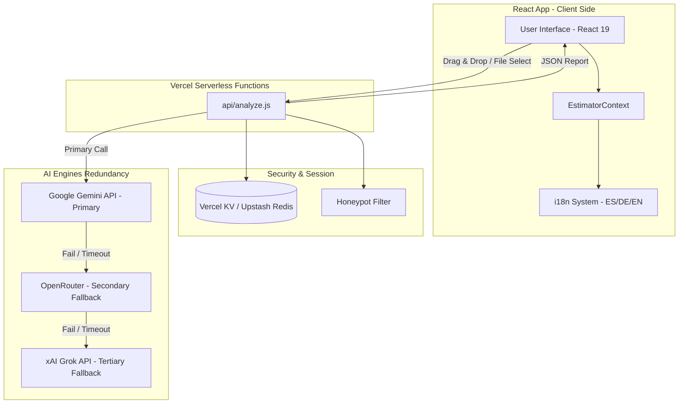
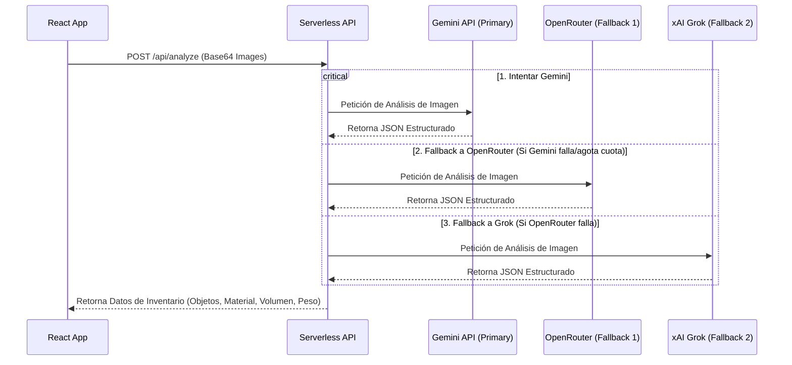

# Technical Architecture & Agent Interaction: Umzug Estimator KI 🧠

Este documento describe la arquitectura técnica, el flujo de datos y la interacción entre agentes de **Umzug Estimator KI**, detallando los componentes frontend, las funciones serverless de backend, el motor de IA de triple redundancia y la infraestructura de control de tasa (Rate Limiting).

### Tecnologías usadas
```javascript
const UmzugEstimator_Project = {
    code: ["React 19", "JavaScript"],
    technologies: {
        devTool: ["VSCode"],
        apis: ["Gemini API", "Vercel Serverless"],
        assets: ["Vercel KV", "i18n"]
    }
};
```
---
## 1. Diagrama de Arquitectura General

El siguiente diagrama Mermaid describe el flujo de peticiones desde la interacción del usuario en el navegador hasta el análisis de IA y almacenamiento efímero:



---

## 2. Flujo de Interacción Técnica

### Paso 1: Petición de Análisis e Inspección de Seguridad
1. El usuario selecciona o arrastra imágenes de una habitación (máximo 10).
2. El cliente React codifica las imágenes en formato Base64 para evitar transferencias complejas y realiza una petición `POST` al endpoint `/api/analyze`.
3. El endpoint `/api/analyze` recibe la petición y ejecuta el middleware de **Rate Limiting** consultando **Vercel KV / Upstash Redis** mediante la IP del cliente (permitiendo un máximo de 5 peticiones cada 10 minutos). Si excede, retorna `429 Too Many Requests`.
4. El endpoint valida la ausencia de bots mediante la técnica de **Bote de Miel (Honeypot)**. Si se detecta un envío automatizado malicioso, la petición se bloquea con `400 Bad Request`.

### Paso 2: Flujo de Redundancia de IA (Fallback de Triple Motor)
Si las validaciones de seguridad son correctas, el backend inicia la comunicación con los motores de Inteligencia Artificial para el análisis de objetos y cálculo de volumen (m³):



---

## 3. Especificación del Payload de API

### `/api/analyze` (POST)
Endpoint para enviar imágenes codificadas y recibir el análisis de objetos con estimaciones físicas.

#### Request Headers
```http
Content-Type: application/json
```

#### Request Body
```json
{
  "images": [
    "iVBORw0KGgoAAAANSUhEUgAA...", // Imagen 1 en Base64 sin prefijo data:image/...
    "iVBORw0KGgoAAAANSUhEUgAA..."  // Imagen 2 en Base64
  ],
  "lang": "es" // "es", "de" o "en"
}
```

#### Response Body (200 OK)
```json
{
  "accumulation_level": "Normal",
  "objects": [
    {
      "id": "a9b8c7d6-e5f4-...",
      "name": "Sofá de 3 plazas",
      "volume_m3": 1.5,
      "weight_kg": 60,
      "material": "Textil",
      "notes": "Sofá tapizado en gris oscuro",
      "detected_from_image": true
    },
    {
      "id": "1a2b3c4d-5e6f-...",
      "name": "Mesa de centro",
      "volume_m3": 0.25,
      "weight_kg": 15,
      "material": "Madera",
      "notes": "Mesa con patas de metal",
      "detected_from_image": true
    }
  ]
}
```

---

## 4. Gestión de Estado Local (Cliente)

Toda la persistencia de datos del usuario es estrictamente del lado del cliente (`client-side`) cumpliendo con las regulaciones GDPR/DSGVO:
- **`EstimatorContext`**: Almacena de forma global el paso actual (`currentStep`), el estado del proyecto (`project`) que incluye los detalles de las habitaciones y el inventario acumulado.
- **`localStorage`**: Se utiliza para persistir la clave `umzug_project`, garantizando que si el usuario refresca el navegador no pierda el progreso de su inventario.

## 📁 Estructura del Proyecto

```
UmzugEstimator2/
├── .env                  # Configuración de variables de entorno locales (API Keys)
├── Branding.md           # Guía de branding oficial del proyecto y logotipos
├── AGENTS.md             # Arquitectura técnica, flujo de agentes y endpoints
├── MANUAL.md             # Manual de usuario y análisis financiero de ROI
├── README.md             # Información principal e instalación rápida
├── api/                  # Backend Serverless Functions (Vercel)
│   └── analyze.js        # Endpoint de análisis y fallback de IA
├── public/               # Activos estáticos públicos
│   └── favicon.svg       # Favicon oficial de la aplicación (Variante 1)
└── src/                  # Código fuente frontend
    ├── assets/           # Imágenes y logos de marca
    │   └── logo.svg      # Logo oficial del proyecto
    ├── components/       # Componentes React (Step1, Step2, Step3, etc.)
    ├── context/          # Contexto de React (EstimatorContext)
    └── utils/            # Utilidades generales y traducciones (i18n)
```
---
> [!NOTE]
> **Explorar siguientes proyectos:**
> *   [`ArteQ`](./ArteQ.md)
> *   [`MyBC`](./MyBC.md)
> *   [`PropuestaGlow`](./PropuestaGlow.md)
> *   [`ArteQ-IT`](./ArteQ-IT.md)
> *   [`3D_Scan`](./3D_Scan.md)
---
