# Diagramme
___
**Entity-Relationship-Model**

# Inventar DB

### Table structure

**firma**

| Name        | Type          | Settings                      | References                    | Note                           |
|-------------|---------------|-------------------------------|-------------------------------|--------------------------------|
| **id** | BIGINT | 🔑 PK, not null , autoincrement |  | |
| **name** | TEXT | not null  |  | |
| **währungssymbol** | TEXT | not null  |  | |
| **iduseradmin** | BIGINT | not null  | firma_iduseradmin_fk | |

**firmazuordnen**

| Name        | Type          | Settings                      | References                    | Note                           |
|-------------|---------------|-------------------------------|-------------------------------|--------------------------------|
| **id** | BIGINT | 🔑 PK, not null , autoincrement |  | |
| **id_firma** | BIGINT | not null  | firmazuordnen_id_firma_fk | |
| **id_user** | BIGINT | not null  | asignarempresa_id_user_fk | |

**kategorien**

| Name        | Type          | Settings                      | References                    | Note                           |
|-------------|---------------|-------------------------------|-------------------------------|--------------------------------|
| **id** | BIGINT | 🔑 PK, not null , autoincrement |  | |
| **beschreibung** | TEXT | not null  |  | |
| **color** | TEXT | not null  |  | |
| **id_firma** | BIGINT | not null  | kategorien_id_firma_fk | |

**kardex**

| Name        | Type          | Settings                      | References                    | Note                           |
|-------------|---------------|-------------------------------|-------------------------------|--------------------------------|
| **id** | BIGINT | 🔑 PK, not null , autoincrement |  | |
| **datum** | DATE | not null  |  | |
| **typ** | TEXT | not null  |  | |
| **id_user** | BIGINT | not null  | kardex_id_user_fk | |
| **id_producto** | BIGINT | not null  | kardex_id_produkt_fk | |
| **anzahl** | BLOB | not null  |  | |
| **id_firma** | BIGINT | not null  | kardex_id_firma_fk | |
| **details** | TEXT | not null  |  | |
| **status** | BIGINT | not null , default: 1 |  | |

**marke**

| Name        | Type          | Settings                      | References                    | Note                           |
|-------------|---------------|-------------------------------|-------------------------------|--------------------------------|
| **id** | BIGINT | 🔑 PK, not null , autoincrement |  | |
| **beschreibung** | TEXT | not null  |  | |
| **id_firma** | BIGINT | not null  | marke_id_firma_fk | |

**modul**

| Name        | Type          | Settings                      | References                    | Note                           |
|-------------|---------------|-------------------------------|-------------------------------|--------------------------------|
| **id** | BIGINT | 🔑 PK, not null , autoincrement |  | |
| **name** | TEXT | not null  |  | |
| **check** | BOOLEAN | not null , default: false |  | |

**berechtigungen**

| Name        | Type          | Settings                      | References                    | Note                           |
|-------------|---------------|-------------------------------|-------------------------------|--------------------------------|
| **id** | BIGINT | 🔑 PK, not null , autoincrement |  | |
| **id_user** | BIGINT | not null  | berechtigungen_id_user_fk | |
| **id_modul** | BIGINT | not null  | berechtigungen_id_modul_fk | |

**produkte**

| Name        | Type          | Settings                      | References                    | Note                           |
|-------------|---------------|-------------------------------|-------------------------------|--------------------------------|
| **id** | BIGINT | 🔑 PK, not null , autoincrement |  | |
| **beschreibung** | TEXT | not null  |  | |
| **id_marke** | BIGINT | not null  | produkte_id_marke_fk | |
| **aktueller _lagerbestand** | NUMERIC | not null  |  | |
| **mindestbestand** | NUMERIC | not null  |  | |
| **barcode** | TEXT | not null  |  | |
| **interner_code** | TEXT | not null  |  | |
| **verkaufspreis** | NUMERIC | not null  |  | |
| **kaufpreis** | NUMERIC | not null  |  | |
| **id_kategorie** | BIGINT | not null  | produkte_id_kategorie_fk | |
| **id_firma** | BIGINT | not null  | produkte_id_firma_fk | |

**users**

| Name        | Type          | Settings                      | References                    | Note                           |
|-------------|---------------|-------------------------------|-------------------------------|--------------------------------|
| **id** | BIGINT | 🔑 PK, not null , autoincrement |  | |
| **namen** | TEXT | not null , default: generic |  | |
| **nr_doc** | TEXT | not null , default: - |  | |
| **telefon** | TEXT | not null , default: - |  | |
| **adresse** | TEXT | not null , default: - |  | |
| **datum_reg** | DATE | not null  |  | |
| **status** | TEXT | not null , default: activ |  | |
| **typuser** | TEXT | not null  |  | |
| **idauth** | TEXT | not null  |  | |
| **typdoc** | TEXT | not null , default: - |  | |
| **email** | TEXT | not null , default: - |  | |

# PlantUML Diagramme
### Ablaufdiagramm
// !theme superhero-outline // !theme crt-green

```plantuml

@startuml

!theme crt-green
!include <C4/C4_Context>
title Ablaufdiagramm - Inventarsystem D.Paz

start

:Benutzername und Passwort eingeben;
:Benutzer validieren;

if (Ist der Benutzer gültig?) then (ja)
  :Hauptmenü anzeigen;
  :Option auswählen;
  switch (Option)
    case (Produkt hinzufügen)
      :Produktdaten eingeben;
      :Produkt in der Datenbank speichern;
    case (Produkt löschen)
      :Zu löschendes Produkt auswählen;
      :Produkt aus der Datenbank löschen;
    case (Produkt aktualisieren)
      :Zu aktualisierendes Produkt auswählen;
      :Neue Produktdaten eingeben;
      :Produkt in der Datenbank aktualisieren;
    case (Inventar anzeigen)
      :Produktliste anzeigen;
    case (Beenden)
      :Sitzung beenden;
  endswitch
  :Zurück zum Hauptmenü;
else (nein)
  :Fehlermeldung anzeigen;
  :Zurück zur Anmeldung;
endif

stop

@enduml

```

### Usecase Diagramm

### Gantt Diagramm

### Projekt

### Komponentendiagramm

```plantuml

@startuml
!theme superhero
!include <C4/C4_Component>

System_Boundary(c1, "Inventar") {
  Component(ui, "Benutzeroberfläche", "React", "Intuitive und responsive Web-Oberfläche")
  Component(api, "API", "Supabase", "API für den Zugriff auf die Datenbank und Authentifizierung")
  Component(db, "Datenbank", "PostgreSQL", "Speicherung der Inventardaten")
  Component(auth, "Authentifizierung", "Supabase Auth", "Verwaltung der Authentifizierung und Autorisierung von Benutzern")
  Component(storage, "Dateispeicher", "Supabase Storage", "Speicherung von Produktbildern")
  Component(reporting, "Berichtsgenerierung", "React-pdf", "Generierung von PDF-Berichten")
  
  Rel(ui, api, "Liest/Schreibt Daten", "API REST")
  Rel(api, db, "Liest/Schreibt Daten")
  Rel(api, auth, "Authentifiziert Benutzer")
  Rel(api, storage, "Speichert/Ruft Bilder ab")
  Rel(ui, reporting, "Generiert Berichte")
}

System_Ext(erp, "ERP-System", "Externes System")

Rel(api, erp, "Optionale Integration", "API")
@enduml

```

### ER-Modell

```plantuml

@startuml
!theme toy

title ER-Modell

entity firma {
  * id (PK)
  --
  name
  währungssymbol
  iduseradmin
}

entity firmazuordnen {
  * id (PK)
  --
  id_firma
  id_user
}

entity kategorien {
  * id (PK)
  --
  beschreibung
  color
  id_firma
}

entity kardex {
  * id (PK)
  --
  datum
  typ
  id_user
  id_producto
  anzahl
  id_firma
  details
  status
}

entity marke {
  * id (PK)
  --
  beschreibung
  id_firma
}

entity modul {
  * id (PK)
  --
  name
  check
}

entity berechtigungen {
  * id (PK)
  --
  id_user
  id_modul
}

entity produkte {
  * id (PK)
  --
  beschreibung
  id_marke
  aktueller_lagerbestand
  mindestbestand
  barcode
  interner_code
  verkaufspreis
  kaufpreis
  id_kategorie
  id_firma
}

entity users {
  * id (PK)
  --
  namen
  nr_doc
  telefon
  adresse
  datum_reg
  status
  typuser
  idauth
  typdoc
  email
}

firma ||--|{ firmazuordnen : "1" Firma "kann mehrere" Benutzer "haben"
firmazuordnen }|--|| users : "1" Benutzer "kann mehreren" Firmen "zugeordnet sein"
kategorien }|--|| produkte : "1" Kategorie "kann mehrere" Produkte "haben"
marke ||--|{ produkte : "1" Marke "kann mehrere" Produkte "haben"
modul ||--|{ berechtigungen : "1" Modul "kann mehreren" Benutzern "zugeordnet sein"
berechtigungen }|--|| users : "1" Benutzer "kann Zugriff auf mehrere" Module "haben"
produkte ||--|{ kardex : "1" Produkt "kann in mehreren" Inventarbewegungen "vorkommen"
users ||--|{ kardex : "1" Benutzer "kann mehrere" Inventarbewegungen "durchführen"

@enduml

```

